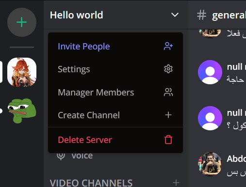

<a name="readme-top"></a>

[![Contributors][contributors-shield]][contributors-url]
[![Forks][forks-shield]][forks-url]
[![Stargazers][stars-shield]][stars-url]
[![Issues][issues-shield]][issues-url]
[![MIT License][license-shield]][license-url]

[contributors-shield]: https://img.shields.io/github/contributors/AbdoWise-z/Discordo?style=for-the-badge
[contributors-url]: https://github.com/AbdoWise-z/Discordo/graphs/contributors

[forks-shield]: https://img.shields.io/github/forks/AbdoWise-z/Discordo?style=for-the-badge
[forks-url]: https://github.com/AbdoWise-z/Discordo/network/members

[stars-shield]: https://img.shields.io/github/stars/AbdoWise-z/Discordo?style=for-the-badge
[stars-url]: https://github.com/AbdoWise-z/Discordo/stargazers

[issues-shield]: https://img.shields.io/github/issues/AbdoWise-z/Discordo?style=for-the-badge
[issues-url]: https://github.com/AbdoWise-z/Discordo/issues

[license-shield]: https://img.shields.io/github/license/AbdoWise-z/Discordo?style=for-the-badge
[license-url]: https://github.com/AbdoWise-z/Discordo/blob/master/LICENSE.txt

<!-- PROJECT LOGO -->
<br />
<div align="center">
  <a href="https://github.com/AbdoWise-z/Discordo">
    
  </a>

<h3 align="center">Discordo</h3>
  <p align="center">
    A discord clone written in TypeScript using React & NextJS.
    <br />
    <br />
    <a href="https://github.com/AbdoWise-z/Discordo/tree/main/cpu"><strong>Explore</strong></a>
    <br />
    <a href="https://discordo-production.up.railway.app">Deployment</a>
    ·
    <a href="https://github.com/AbdoWise-z/Discordo/tree/main/images">Images</a>
    ·
    <a href="https://github.com/AbdoWise-z/Discordo/issues">Request Feature</a>
  </p>
</div>

<!-- TABLE OF CONTENTS -->
## Table of Contents
<ol>
  <li>
    <a href="#about-the-project">About The Project</a>
    <ul>
      <li><a href="#built-with">Built With</a></li>
      <li><a href="#features">Features</a></li>
    </ul>
  </li>
  <li>
    <a href="#getting-started">Getting Started</a>
  </li>
  <li><a href="#gallery">Gallery</a></li>
  <li><a href="#contributing">Contributing</a></li>
  <li><a href="#license">License</a></li>
  <li><a href="#contact">Contact</a></li>
</ol>

<!-- ABOUT THE PROJECT -->
## About The Project
This repository features a fullstack discord clone written in TypeScript.
The project was made out of passion, it's not intended to be used commercially, but you are allowed
to do so if you want (make sure to fix the authentication issues in the code cuz I skip some checks
to not overload the database since I just a free version).
The Project is Deployed [here](https://discordo-production.up.railway.app) in case you want to check it out.


### Built With

The Project was built using TypeScript with frameworks and libraries such as:
- NextJS
- React
- Prisma
- Tailwind
- Socket.IO
- LiveKit


<p align="right">(<a href="#readme-top">back to top</a>)</p>

## Features
This discord clone covers various range of features, some of them are:
- Creating & Managing Servers
- Creating & Managing Channels
  - Audio
  - Video
  - Text
- Inviting People to servers
- Managing server's members
- Managing Roles and permissions
- Using MD to create styled messages
- Realtime text chatting using Socket.IO
- Realtime Audio and Video chatting using LiveKit
- Sharing files and Images using Uploadthing
- support of one-to-one conversations
- and more...

<!-- GETTING STARTED -->
## Getting Started
Before you begin, ensure you have the following installed:

- [Node.js](https://nodejs.org/) (v14.x or later)
- [npm](https://www.npmjs.com/) (v6.x or later) or [Yarn](https://yarnpkg.com/) (v1.22.x or later)
- A code editor, such as [Visual Studio Code](https://code.visualstudio.com/)

#### Steps
1. Clone the Repository
```bash
git clone https://github.com/AbdoWise-z/Discordo.git
cd Discordo
```
2. Install Dependencies
Install the necessary dependencies using npm:
```bash
npm install
```
3. Configure Environment Variables
Create a .env file in the root of the project and configure the following variables:
```env
NEXT_PUBLIC_CLERK_PUBLISHABLE_KEY= [head to clerk to optain]
CLERK_SECRET_KEY= [head to clerk to optain]
NEXT_PUBLIC_CLERK_SIGN_IN_URL=/sign-in
NEXT_PUBLIC_CLERK_SIGN_UP_URL=/sign-up
NEXT_PUBLIC_CLERK_AFTER_SIGN_IN_URL=/
NEXT_PUBLIC_CLERK_AFTER_SIGN_UP_URL=/
DATABASE_URL= [replace with you db connection string]
UPLOADTHING_SECRET= [head to uploadthing to optain]
UPLOADTHING_APP_ID= [head to uploadthing to optain]
LIVEKIT_API_KEY= [head to livekit to optain]
LIVEKIT_API_SECRET= [head to livekit to optain]
NEXT_PUBLIC_LIVEKIT_URL= [head to livekit to optain]
```
4. Build & Run the Project
use the following command to generate an optimized build files:
```bash
npm run build
```
then run the project using:
```bash
npm start
```

or you can run dev version using:
```bash
npm run dev
```

<p align="right">(<a href="#readme-top">back to top</a>)</p>

## Gallery
<table align="cetner">
<td>


</td>
</table>

<div align="center">
<p>Different Themes</p>
</div>
<p align="right">(<a href="#readme-top">back to top</a>)</p>


<table align="cetner">
<td>


</td>
</table>
<div align="center">
<p>Creating Servers</p>
</div>
<p align="right">(<a href="#readme-top">back to top</a>)</p>


<table align="cetner">
<td>


</td>
</table>
<div align="center">
<p>Creating Channels, Inviting people & Search</p>
</div>
<p align="right">(<a href="#readme-top">back to top</a>)</p>


<table align="cetner">
<td>


</td>
</table>
<div align="center">
<p>Chatting features</p>
</div>
<p align="right">(<a href="#readme-top">back to top</a>)</p>


<table align="cetner">
<td>


</td>
</table>
<div align="center">
<p>Managing members and server settings.</p>
</div>
<p align="right">(<a href="#readme-top">back to top</a>)</p>

<!-- CONTRIBUTING -->
## Contributing

Contributions are what make the open source community such an amazing place to learn, inspire, and create. Any contributions you make are **greatly appreciated**.

This project was developed by
<table>
<tr>

<td align="center">
<a href="https://github.com/AbdoWise-z" target="_black">
<br /><sub><b>Abdulrahman Mohammed</b></sub> <br/></a>
</td>


</tr>
</table>

If you have a suggestion that would make this better, please fork the repo and create a pull request. You can also simply open an issue with the tag "enhancement".
Don't forget to give the project a star! Thanks again!

1. Fork the Project
2. Create your Feature Branch (`git checkout -b feature/AmazingFeature`)
3. Commit your Changes (`git commit -m 'Add some AmazingFeature'`)
4. Push to the Branch (`git push origin feature/AmazingFeature`)
5. Open a Pull Request

<p align="right">(<a href="#readme-top">back to top</a>)</p>

<!-- LICENSE -->
## License

Distributed under the MIT License. See `LICENSE.txt` for more information.

<p align="right">(<a href="#readme-top">back to top</a>)</p>

<!-- CONTACT -->
## Contact

[Abdulrahman Mohammed Abdulfattah](https://www.linkedin.com/in/abdulrahman-mohamed-5b3506252/) - <moh2002.abdow@gmail.com>

<p align="right">(<a href="#readme-top">back to top</a>)</p>